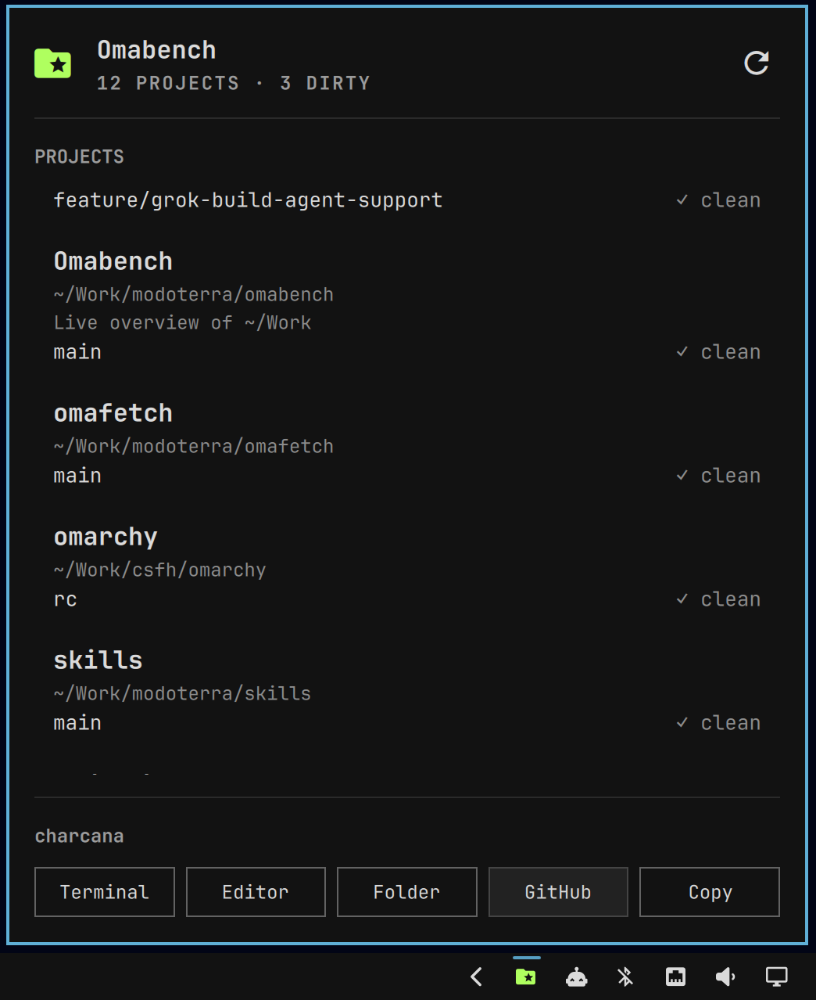

# Omabench

Omabench turns `~/Work` into a desktop workspace. It walks that folder for git repositories and keeps a live row for each one: name, path, branch, dirty or clean, ahead and behind, and listening ports.

Click a project to open a terminal, the editor, the folder, or GitHub, or to copy its path.



## Install

```sh
omarchy plugin add https://github.com/modoterra/omabench.git --enable
```

The widget lands on the right of the bar. Move it with:

```sh
omarchy bar move modoterra.omabench --section right
```

## Usage

Left click the mark to open the project list. Right click refreshes immediately. The mark shifts from green to red as more projects are dirty.

Inside the panel:

- click a project to select it (hover does not change the selection)
- `j` / `k` or arrows: move between projects
- `h` / `l`: move onto the action pills
- `enter` / `space`: open a terminal, or run the highlighted action
- double click a row: open a terminal in that project
- `t` / `1` terminal · `e` / `2` editor · `f` / `3` folder · `g` / `4` GitHub · `c` / `5` copy path
- project commands sit in a separate row; the first click shows the real command and asks before running
- `r` refresh
- `esc` close

## Configure

The default work folder is `~/Work`. Point it somewhere else in `~/.config/omarchy/shell.json` on the `modoterra.omabench` bar entry:

```json
{
  "id": "modoterra.omabench",
  "workRoot": "~/Work",
  "refreshIntervalSec": 8,
  "maxDepth": 6
}
```

Refresh is every 8 seconds while the panel is closed, and every 4 seconds while it is open.

## Omafile

Drop an `Omafile` in the project root to name the card, add a summary, set the site URL, and attach commands. The file is TOML. Projects without one keep the folder name and built-in actions.

```toml
name = "Omabench"
summary = "Live overview of ~/Work"
url = "https://github.com/modoterra/omabench"

[[actions]]
label = "Dev"
run = ["bun", "run", "dev"]
```

`command = "bun run dev"` is also accepted when it parses to the same kind of argument list.

`name` replaces the folder name. `summary` sits under the path. `url` feeds the GitHub or site button. Each allowed `actions` entry becomes a button in a **Project commands** row, not next to Terminal and Editor.

An Omafile command is the same trust decision as running that project's Makefile or `package.json` script. Omabench does not run free-form shell. It only accepts a fixed set of task runners (`just`, `make`, `npm` / `pnpm` / `yarn` / `bun run`, `cargo`, `go`, `docker compose`, `python3 -m`, and a few others) with plain arguments. Labels cannot reuse built-in names such as Terminal or Editor.

The first time you click a project command, the panel shows the exact arguments and the project path. **Trust** records that command for that project and then runs it in a new terminal. Later clicks of the same command skip the prompt. If the command in the Omafile changes, Omabench asks again.

Trusted commands are stored in `~/.local/state/omabench/trust.json` (or `$XDG_STATE_HOME/omabench/trust.json`). Delete that file to forget every remembered command.

A broken or rejected `Omafile` is shown on that row. Omabench still lists the project.

## Remove

```sh
omarchy plugin remove modoterra.omabench
```
